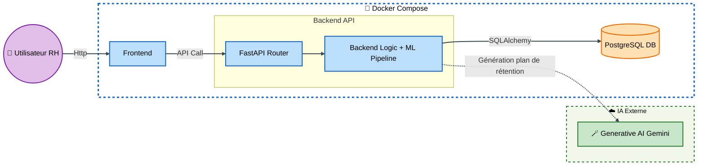
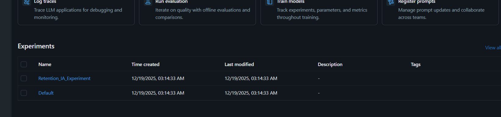
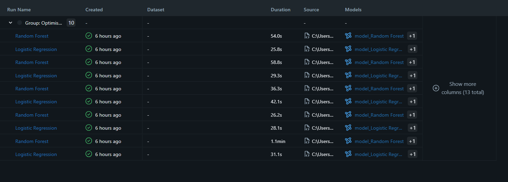
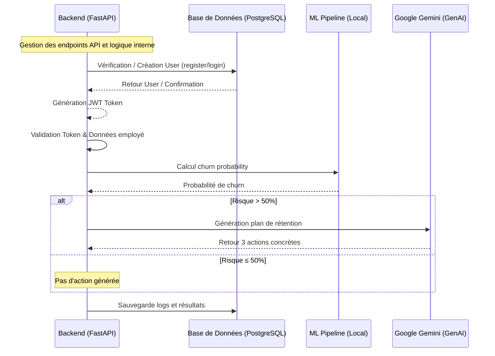

# Retention_IA_Platform_Backend


 

##  Présentation
RetentionAI est le moteur d'intelligence décisionnelle pour les RH. Ce backend expose une API REST sécurisée permettant de prédire le risque de départ des employés et de générer des stratégies de rétention via l'IA Générative 

## Table des matières

1. [Présentation](#présentation)
2. [Objectifs du Projet](#objectifs-du-projet)
3. [Architecture Globale du Projet](#architecture-globale-du-projet)
4. [Stack Technique](#stack-technique)
5. [Installation et Lancement](#installation--lancement)
6. [Tests](#tests)
7. [Pipeline Machine Learning](#pipeline-machine-learning)
8. [Documentation de l’API](#documentation-de-lapi)
9. [IA Générative et Prompt Engineering](#ia-générative-et-prompt-engineering)
10. [Tests Unitaires Backend](#tests-unitaires-backend)
11. [Structure du Projet](#structure-du-projet)
12. [Auteur](#auteur)


## Objectifs du Projet

### Business
*   **Anticiper** : Identifier les profils à haut risque de démission avant qu'ils ne quittent l'entreprise.
*   **Agir** : Proposer des actions RH concrètes et personnalisées pour chaque collaborateur.
*   **Optimiser** : Réduire les coûts liés au turnover et préserver les talents clés.

### Techniques
*   Mise en œuvre d'un pipeline ML supervisé (Scikit-Learn).
*   Développement d'une API sécurisée sous FastAPI.
*   Intégration d'une IA générative (Gemini) pour les recommandations.
*   Conteneurisation via Docker pour un déploiement industriel.
##  Architecture Globale du projet

Le projet est entièrement conteneurisé via Docker. Le backend (FastAPI) agit comme une passerelle d'orchestration entre le frontend (React), la base de données et les services IA externes.


##  Stack Technique
- **Framework :** FastAPI (Python )
- **Machine Learning :** Scikit-Learn, Pandas,GridSearchCV, MLflow,Joblib
- **IA Générative :** Google Gemini API 
- **Base de données :** PostgreSQL (SQLAlchemy)
- **Sécurité :** JWT (JSON Web Tokens) & argon2
- **Conteneurisation :** Docker / Docker-compose


## Installation & Lancement

### 1. Cloner le projet
```bash
git clone https://github.com/khadija199904/Retention_IA_Platform_Backend.git
cd Retention_IA_Platform_Backend
```

### 2. Environnement(.env)
1. **Env** : Créer un fichier `.env` avec vos clés API et accès DB.
```bash
POSTGRES_USER=USE
POSTGRES_PASSWORD=PASSWORD
POSTGRES_HOST=localhost
POSTGRES_DB=DN_NAME
POSTGRES_PORT=PORT

GEMINI_API_KEY = "AI**************************************"
SECRET_KEY = "************************"
```

### 3. Lancement avec Docker (Recommandé)
```bash
 docker-compose up --build
```
L'API sera accessible sur http://localhost:8000. La documentation Swagger est disponible sur /docs.

## Tests
```bash
pytest -v
```
## Pipeline Machine Learning
### Flux complet du 

```mermaid
graph LR
    %% --- DEFINITION DES COULEURS ---
    classDef step fill:#BBDEFB,stroke:#1565C0,stroke-width:2px,color:#000;
    classDef preprocess fill:#FFE0B2,stroke:#EF6C00,stroke-width:2px,color:#000;
    classDef train fill:#C8E6C9,stroke:#2E7D32,stroke-width:2px,color:#000;
    classDef optimize fill:#E1BEE7,stroke:#7B1FA2,stroke-width:2px,color:#000;
    classDef track fill:#F1F8E9,stroke:#2E7D32,stroke-width:2px,color:#000;

    %% --- PIPELINE ML ---
    EDA[Analyse Exploratoire EDA - Corrélations: Salaire, Distance, Satisfaction]:::step
    Preprocess[Préprocessing - Suppression colonnes inutiles, OneHotEncoder, StandardScaler]:::preprocess
    Training[Entraînement - Régression Logistique vs Random Forest]:::train
    Optimization[Optimisation - GridSearchCV pour meilleurs paramètres]:::optimize
    Tracking[Tracking des métriques - MLflow : Précision, Recall, AUC]:::track

    %% --- FLUX ---
    EDA --> Preprocess
    Preprocess --> Training
    Training --> Optimization
    Optimization --> Tracking

```

### Interface MLflow –Visualisation des Expériences

Le suivi MLflow permet de visualiser facilement les métriques, paramètres et modèles. Voici un exemple d’affichage :
Interface : 
Modèles Entraînés : 

# Documentation de l'API

## Authentification

| Méthode | Endpoint  | Description |
|---------|-----------|-------------|
| POST    | /register | Création d'un compte RH (mot de passe hashé via Bcrypt). |
| POST    | /login    | Retourne un Access Token JWT (valide 30 min). |

## Endpoints Métier (Sécurisés par JWT)

| Méthode | Endpoint                  | Description |
|---------|---------------------------|-------------|
| POST    | /predict                  | Calcule la probabilité de départ d’un employé. |
| POST    | /generate-retention-plan  | Calcule le risque via le modèle ML. Si le risque > 50%, déclenche l'IA générative pour créer 3 actions concrètes. Enregistre la transaction dans l'historique PostgreSQL. |

##  IA Générative et Prompt Engineering

Le système utilise un prompt dynamique envoyé à l'IA externe pour assurer la pertinence des conseils :
"Agis comme un expert RH. Voici les informations sur l’employé : [Age, JobRole, Satisfaction, Performance]. Ce salarié a un risque élevé de départ (score : [Proba]%). Propose 3 actions concrètes et opérationnelles pour le retenir."
## Workflow API



### Gestion des erreurs

|  Incident  |   Code HTTP |
|------------|--------------|
| champs vides | 40O Bad request |
| Token invalide ou absent | 401 Unauthorized |
| Données envoyées invalides | 422 Unprocessable Entity |
| Hugging Face Timeout | 504 Gateway Timeout |
| Hugging Face Erreur Réseau | 502 Bad Gateway |
| Gemini indisponible | 503 Service Unavailable |
| Réponse Gemini mal formée / JSON invalide | 500 Internal Server Error |
| Score de classification trop faible | 400 Bad Request |

## Tests Unitaires (Backend)
Pour lancer les tests (nécessite Python localement) :
```bash
cd backend
# Créer un environnement virtuel
python -m venv venv
source venv/bin/activate
# Installer les dépendances
pip install -r requirements.txt
# Lancer les tests
pytest  -v 

```

##  Structure du Projet : 
```bash
RetentionAI/
│
├── .github/workflows/              # Automatisation CI/CD
│   └── test.yml                    # Workflow pour tests et build Docker
│
├── api_app/                        # Application Backend FastAPI
│   ├── __init__.py
│   ├── main.py                     # Point d'entrée de l'API
│   ├── database.py                 # Configuration SQLAlchemy & Connexion
│   ├── dependencies.py             # Dépendances (get_db, oauth2_scheme)
│   │
│   ├── core/                       # Paramètres globaux
│   │   ├── __init__.py
│   │   ├── config.py               # Gestion du .env (pydantic-settings)
│   │   └── security.py             # Logique JWT et Bcrypt
│   │
│   ├── crud/                       # Opérations Base de Données
│   │   ├── __init__.py
│   │   └── create_user.py          # Logique de création d'utilisateurs RH
│   │
│   ├── models/                     # Modèles SQLAlchemy (ORM)
│   │   ├── __init__.py
│   │   ├── users.py                # Table "users"
│   │   └── predictions.py          # Table "predictions_history"
│   │
│   ├── outils/                     # Utilitaires transverses
│   │   ├── __init__.py
│   │   ├── get_prediction.py
│   │   ├── build_rh_prompt.py
│   │   ├── load_model.py
│   │   └── predictions_history.py        # Sauvegarde des résultats en DB
│   │
│   ├── routers/                    # Points d'accès (Endpoints)
│   │   ├── __init__.py
│   │   ├── predict.py              # POST /predict et /generate-plan
│   │   ├── analyse.py              # POST /predict et /generate-plan
│   │   └── auth.py                 # POST /register et /login
│   │
│   ├── schemas/                    # Validation Pydantic
│   │   ├── __init__.py
│   │   ├── employe_schema.py             # Validation des données employé 
│   │   ├── generate_plan_schema.py        # Schémas de repone /generate-retention-plan
│   │   ├── user_schema.py                 # Schémas UserCreate
│   │   └── predict_schema.py              # Schémas de réponse prédiction
│   │
│   └── services/                   # Appels aux IA Externes
│       ├── __init__.py
│       └── generative_IA.py           # Logique  Google Gemini
│
├── ml/                             # Partie Science des Données
│   ├── artifacts/                  # Matrice de confudion , repport classication , ROC courbe
│   ├── saved_models/               # Modèles entraînés (model.pkl)
│   ├── Attrition-RH-Data.csv       # Dataset brut
│   ├── Fonctions.py                # Fonctions de traitement ML (RIAF-10)
│   ├── analyse-preparation.ipynb   # Notebook de l'EDA
│   └── pipeline.py                 # Script d'entraînement et sauvgarde du moèle
│
├── Tests/                          # Tests Unitaires et Intégration
│   ├── __init__.py
│   ├── test_LLM_response.py        # Test des appels API Gemini
│   └── test_load_model.py          # Test de chargement du fichier .pkl
│
├── .dockerignore                   # Fichiers à exclure du conteneur
├── .env                            # Variables secrètes (Clés API, DB URL)
├── .gitignore                      # Fichiers à exclure de Git
├── Dockerfile                      # Instruction de build de l'image
├── docker-compose.yml              # Orchestration (API + PostgreSQL)
├── README.md                       # Documentation complète
└── requirements.txt                # Liste des dépendances Python
```

## Auteur

**Nom :** KHADIJA ELABBIOUI  
**Email :** khadija.elabbioui1999@gmail.com  
**LinkedIn :** [linkedin.com/in/khadija-elabbioui](https://www.linkedin.com/in/khadija-elabbioui-308499216/)  
**GitHub :** [github.com/ton-github](https://github.com/khadija199904)